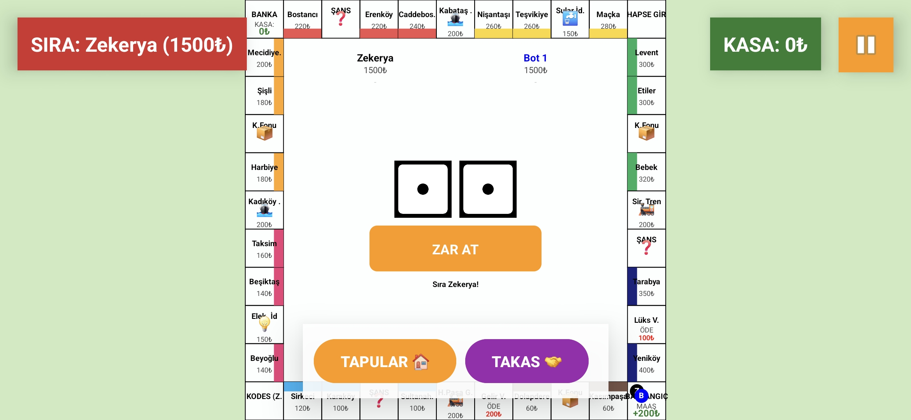
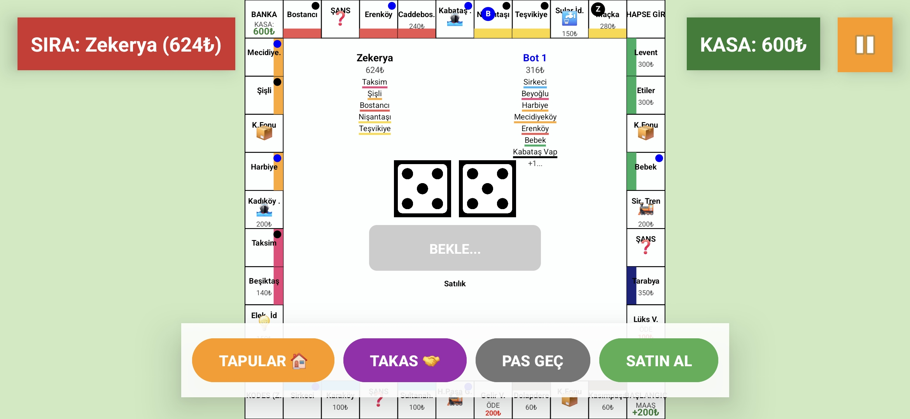

# 🎲 Monopoly Android Game

Kotlin ile geliştirilmiş, gelişmiş yapay zeka (Bot) desteği ve dinamik arayüzü olan bir Monopoly klonu.

## 📱 Ekran Görüntüleri

| Giriş Ekranı | Oyun Masası (2 Kişilik) |
|:---:|:---:|
|  |  |

## 🌟 Özellikler

* **Akıllı Bot Sistemi:** Yapay zeka, parası yetiyorsa mülk alır, sıkışırsa ipotek yapar, takas tekliflerini değerlendirir.
* **Dinamik Arayüz:**
    * 2 kişilik oyunlarda oyuncular sağ ve sol kenarlara yaslanır (Ferah görünüm).
    * 4-6 kişilik oyunlarda ekran ızgara (grid) sistemine döner.
* **Özelleştirilebilir Oyun:** Oyuncu sayısı (1-6) ve Bot sayısı (0-5) seçilebilir.
* **Tam Oyun Kuralları:**
    * Kira, İpotek, İflas mekanikleri.
    * İstasyon ve İskele kira çarpanları (1 adet: 25₺ -> 4 adet: 200₺).
    * Kodes ve Ziyaretçi mantığı.
    * Başlangıç noktasından geçince maaş (+200₺) kontrolü.
    * Şans ve Kamu Fonu kartları.

## 🛠️ Teknolojiler

* **Dil:** Kotlin
* **UI:** Custom Views (Canvas Çizimi), XML
* **Veri:** Gson (JSON ile Kayıt Sistemi)

## 🎮 Nasıl Oynanır?

1.  Giriş ekranından oyuncu ve bot sayısını seçin.
2.  İsimlerinizi girin.
3.  Zar atın ve emlak imparatorluğunuzu kurun!
